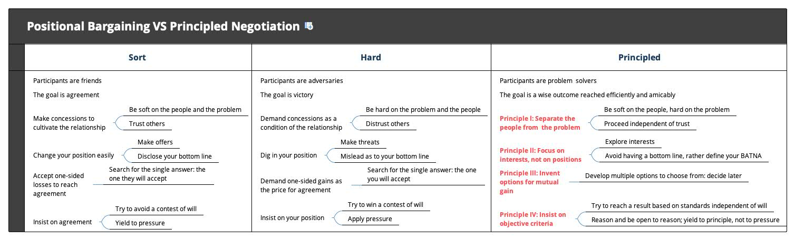

# 谈判技巧 - 我的谈判学习笔记

谈判不是商业领域特有的行为，而是我们每日都在进行的事情。谈判不是讲计谋，而是讲如何更好的沟通。谈判不能让我们得到所有，但可以让我们得到更多。

## 公开课

### [Successful Negotiation: Essential Strategies and Skills](https://www.coursera.org/learn/negotiation-skills)

Coursera上经典的课程，中文译名《成功的谈判：基本策略与技巧》。是我接触谈判的第一课，对于很多内容讲的很浅，但是很适合初学者建立谈判的知识框架，躲过常犯的错误。

## 读书笔记

### Getting More
《Getting More》是我读的第一本谈判类书籍，中文译名《沃顿商学院最受欢迎的谈判课》。

可以下载[xmind原始版本](Getting-More-知识点总结.xmind)和[PNG](Getting-More-知识点总结.png)版本。

### Getting to Yes

《Getting to Yes》中文译名《谈判力》，是一本硬核的谈判书籍。核心是原则谈判法，因为作者Fisher教授生前在哈佛大学任教，这个方法也被叫做哈佛谈判法(The Harvard Approach)。

>There is a third way to negotiate, a way neither hard nor soft, but rather both hard and soft. The method of principled negotiation developed at the Harvard Negotiation Project is to decide issues on their merits rather than through a haggling process focused on what each side says it will and won’t do. It suggests that you look for mutual gains whenever possible, and that where your interests conflict, you should insist that the result be based on some fair standards independent of the will of either side. The method of principled negotiation is hard on the merits, soft on the people. It employs no tricks and no posturing. Principled negotiation shows you how to obtain what you are entitled to and still be decent. It enables you to be fair while protecting you against those who would take advantage of your fairness.

我之所以喜欢原则谈判法，不仅仅因为它是一个谈判方法，可以引导我解决冲突，保护自己的利益。也是因为它让我可以成为一个善良的人。

通过对比软、硬两种谈判风格，原则谈判法主要特点如红字所示。

